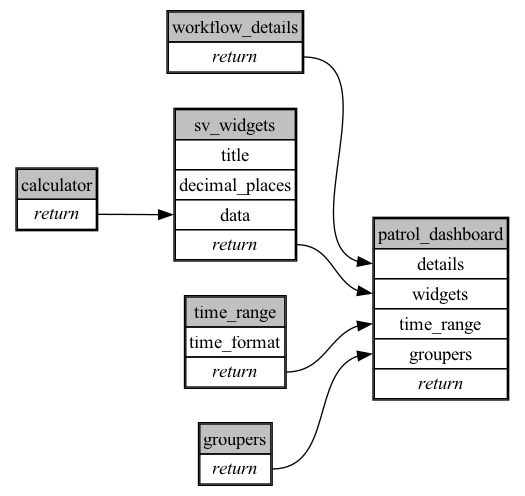

```
# AUTOGENERATED BY ECOSCOPE-WORKFLOWS; see fingerprint in README.md for details

```

```yaml
# fingerprint:
artifacts_sha256_basic: 6a87045d49deed9ab188f930eff2e65c09da24de86dc6295f570f83dbeab8445
artifacts_sha256_strict: 858e41697f68c8d6b798fd21597361a52b539e563144bbb4391db6a01a960f92
installed_requirements:
- channel: file:///tmp/ecoscope-workflows/release/artifacts/
  name: ecoscope-workflows-core
  version: {version: ==0.0.67}
- channel: file:///tmp/ecoscope-workflows/release/artifacts/
  name: ecoscope-workflows-ext-ecoscope
  version: {version: ==0.0.67}
params_sha256: 4ef9accea2516723eb19da9754e67a3a8ecd04f4f7ea69096d98e42887beafd6
spec_sha256: 26a8f9dec125ac0b3a329f39baf4257c9c0ab8541935afed0250b8bfea7cd9c5

```

# ecoscope-workflows-ndvi-workflow


