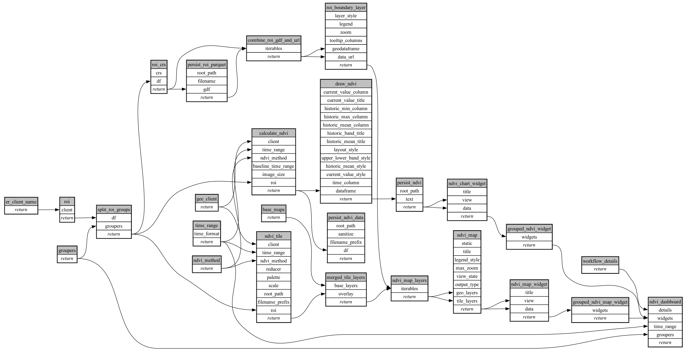

```
# AUTOGENERATED BY ECOSCOPE-WORKFLOWS; see fingerprint in README.md for details

```

```yaml
# fingerprint:
artifacts_sha256_basic: ebdba21130d06a260bedebac8b71807793a9494dc835c6bf8c91ddd0c7436f9c
artifacts_sha256_strict: 2da7c3840da20850e3434198efe7a30deb97686201cfd62e0bdf8f9934dd1d88
installed_requirements:
- channel: https://repo.prefix.dev/ecoscope-workflows/
  name: ecoscope-platform
  version: {version: ==2.20.0}
- channel: conda-forge
  name: pydeck
  version: {version: ==0.9.2}
- channel: https://repo.prefix.dev/ecoscope-workflows-custom/
  name: ecoscope-workflows-ext-custom
  version: {version: ==0.1.0}
params_sha256: da68699973ec82684d366cfa2270a76f0cf09152fe7b124f1b6aa36e4ca180ff
spec_sha256: 47543840fc1929389f77a113f27321253afcaa1f443f6c8763594a616aba818f

```

# ecoscope-workflows-ndvi-workflow


