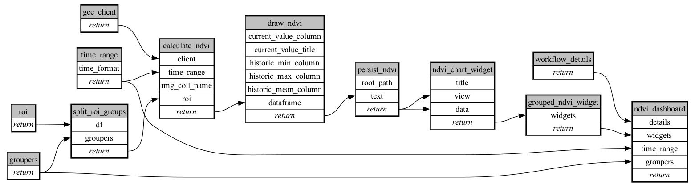

```
# AUTOGENERATED BY ECOSCOPE-WORKFLOWS; see fingerprint in README.md for details

```

```yaml
# fingerprint:
artifacts_sha256_basic: 35d035eeab18e4a4cf9f775dc1508bfd9bf907b7edee678bfb71ab276bfb4e68
artifacts_sha256_strict: e2f4e3f886266793c5045b477ba19c2b8337671debd2a0f6a64f72e5ac72d903
installed_requirements:
- channel: file:///tmp/ecoscope-workflows/release/artifacts/
  name: ecoscope-workflows-core
  version: {version: ==0.0.67}
- channel: file:///tmp/ecoscope-workflows/release/artifacts/
  name: ecoscope-workflows-ext-ecoscope
  version: {version: ==0.0.67}
params_sha256: 06e2db7cb14c8d24361d298f07737a2ad5a4665984301a91995e370e1c915b98
spec_sha256: 6d6424d163937622dd9641372443341b0368cbc96c8375957400a8dc07f6a822

```

# ecoscope-workflows-ndvi-workflow


